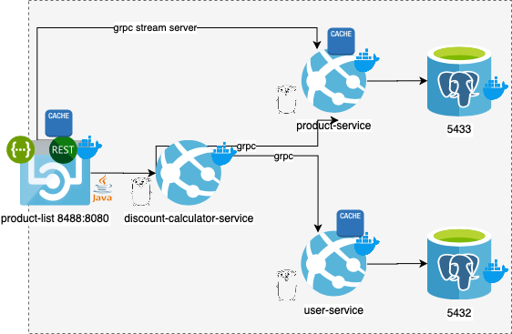

# HASH Challenge

More infos about the challenge, click [here.](https://github.com/hashlab/hiring/blob/master/challenges/en-us/backend-challenge.md)

## DIAGRAM


See below an overview.




## PRODUCT-LIST

This service exposes a HTTP endpoint GET /product that returns a list of products.
The endpoint response must be JSON encoded.
To calculate each product discount the service must consume service 1 via gRPC.
If service 1 errors while calculating a discount, the service must returns the product list but with zero discounts for the affected products.

```bash

# clean
make clean

# install dependencies
make dependencies

# compile
make compile

# build 
make build

# Curl
curl -X GET "http://localhost:8488/product?X-USER-ID=e8687b58-02fd-561b-a71b-35ed118bcdca" -H  "accept: */*"
```
### Header
  - X-USER-ID - Default: Empty - Optional

---

### Environments

```bash

# .web-api.env

# Host and Port DISCOUNTCALCULATOR
QUARKUS_GRPC_CLIENTS_DISCOUNTCALCULATOR_HOST=discount-calculator-service
QUARKUS_GRPC_CLIENTS_DISCOUNTCALCULATOR_PORT=50001

# Host and Port PRODUCTS
QUARKUS_GRPC_CLIENTS_PRODUCTS_HOST=product-service
QUARKUS_GRPC_CLIENTS_PRODUCTS_PORT=50001

QUARKUS_LOG_LEVEL=INFO
QUARKUS_DEBUG_REFLECTION=true
QUARKUS_HTTP_PORT=8080
```

## PRODUCTS

This service is a grpc service that return a list or product by ID, this service uses an exclusive database.

### [_Api_](./protorepo/products.proto)
 
```proto
service ProductService {
  rpc GetByID(RequestProduct) returns (Product) {}; unary
  rpc List(google.protobuf.Empty) returns (stream Product) {}; server-stream
}
```

```bash

# clean
make clean

# dependencies
make dependencies

# build
make build

```

More commands you can see [here.](/products/Makefile)

### Environments

```bash
#.env

# DB_DRIVER default-postgres
DB_DRIVER=postgres

# DB_HOST default=localhost
DB_HOST=user-db

#DB_USER default=postgres 
DB_USER=postgres 

#DB_NAME default=product
DB_NAME=users

#DB_PORT default=5432
DB_PORT=5432

#DB_PASSWORD default=hash
DB_PASSWORD=hash
```

*WARN* -> If you change, remember to set the same values on [database.env.](./products/.env) 

---

## PROTOREPO

This is an repository to store proto files that you can shared into apps to generate clients and servers.

- [discount-calculator](./protorepo/discountcalculator.proto)
- [products](./protorepo/products.proto)
- [users](./protorepo/users.proto)

--- 

## USERS

This service is a grpc service that return a list or product by ID, this service uses an exclusive database.

### [_Api_](./protorepo/users.proto)

```proto
service ProductService {
  rpc GetByID(RequestUser) returns (User) {}; // unary
}
```

```bash

# clean
make clean

# dependencies
make dependencies

# build
make build

```

More commands you can see [here.](/products/Makefile)

### Environments

```bash

# DB_DRIVER default-postgres
DB_DRIVER=postgres

# DB_HOST default=localhost
DB_HOST=user-db

#DB_USER default=postgres 
DB_USER=postgres 

#DB_NAME default=user
DB_NAME=users

#DB_PORT default=5432
DB_PORT=5432

#DB_PASSWORD default=hash
DB_PASSWORD=hash
```
--- 

*WARN* -> If you change, remember to set the same values on [database.env.](./users/.env) 

## DISCOUNT CALCULATOR

This service is responsable to calculate discount following the rules below:

- If it's the user’s birthday, the product has 5% discount.
- If it is black friday BLACK_FRIDAY=2020-11-25, the product has 10% discount
- No product discount can be bigger than 10%

### [_Api_](./protorepo/discountcalculator.proto)

```proto
service DiscountCalculatorService {
  rpc Process(DiscountRequest) returns (DiscountResponse); //unary
}
```

```bash

# clean
make clean

# dependencies
make dependencies

# build
make build

```

More commands you can see [here.](/products/Makefile)


### Environments

```bash
# .env

# USER_SERVICE_HOST default=localhost 
USER_SERVICE_HOST=user-service

# USER_SERVICE_PORT default=50001
USER_SERVICE_PORT=50001

#PRODUCT_SERVICE_HOST default=localhost
PRODUCT_SERVICE_HOST=product-service

# PRODUCT_SERVICE_PORT default=50001
PRODUCT_SERVICE_PORT=50001

# BLACK_FRIDAY default=2020-11-25
BLACK_FRIDAY=2020-11-25
```

## DOCKER

```bash
# buil all services first
make build-all

## Run all services in a container
make docker-upbuild

```
Considerações:

- Cada serviço possui um arquivo Makefile com os principais comandos utilizados, e no diretório raíz possui um para buildar dos os serviços. 
- Foi incluído um cache de 60s para evitar algumas chamadas no banco.
- Há um docker-compose com todos os serviços já configurados. A maioria das configurações estão disponíveis através de variaveis de ambiente.
- O serviço PRODUCT-LIST possui um swagger-ui para testar GET /product
- A data da black friday pode ser configurada nas variáveis de ambiente do serviço DISCOUNTCALCULATOR.
- No diretorio _/infra_ dos serviços PRODUCTS e USERS há um arquivo _02-data.sql_ onde há alguns registros para popular a base, alguns deles já tem data de aniversário para os próximos dias.
-  _:8488/health_ pode-se consultar o status da aplicação
-  _:8488/metrics_ pode-se consultar as métricas